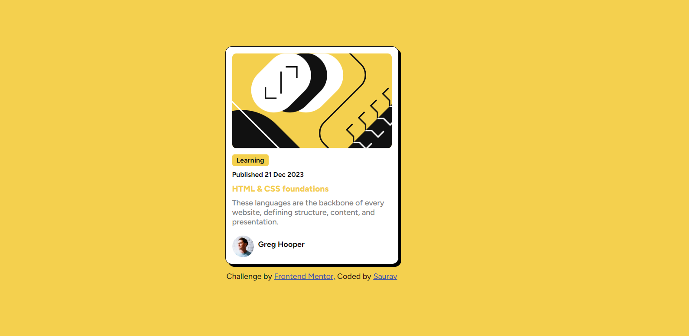
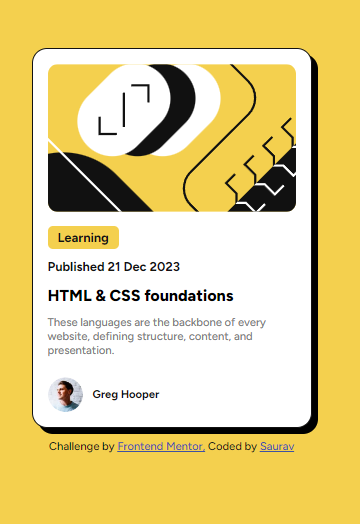

# Frontend Mentor - Blog Preview Card Solution

👋 Welcome to my solution. This project helped me refine my front-end skills by working on a clean and responsive card design. Feel free to explore the code and provide any feedback. Happy coding! 😊🚀

## Table of contents

- [Overview](#overview)
  - [The challenge](#the-challenge)
  - [Screenshot](#screenshot)
  - [Links](#links)
- [My process](#my-process)
  - [Built with](#built-with)
  - [What I learned](#what-i-learned)
  - [Continued development](#continued-development)
  - [Useful resources](#useful-resources)
- [Author](#author)
- [Acknowledgments](#acknowledgments)

## Overview

### Screenshot

### Links

- Solution URL: [GitHub Repository](https://github.com/TechNinjaCode/WebDev-Challenges/tree/main/Blog%20Preview%20Card)
- Live Site URL: [Live Preview](https://web-dev-challenges.vercel.app/)

## My process

### Built with

- Semantic HTML5 markup
- CSS custom properties
- Flexbox
- Mobile-first workflow

### What I learned

- **Responsiveness**: I applied responsive design principles to make the blog preview card work well on both mobile and desktop devices.
- **CSS Flexbox**: I used Flexbox to create clean and flexible layouts, improving my understanding of this layout module.

### Continued development

In future projects, I plan to:

- Enhance the accessibility of my components
- Continue improving my CSS Grid and Flexbox skills
- Experiment with animations and transitions for more interactive designs
- Focus on responsive design techniques to ensure a seamless experience across devices
- Integrate interactive elements for a more engaging user experience
- Maintain good documentation practices for better project clarity and collaboration

### Useful resources

- [MDN Web Docs](https://developer.mozilla.org/en-US/docs/Web) - Comprehensive HTML, CSS, and JavaScript documentation. This is my go-to resource for learning about web technologies and understanding their usage.
- [W3Schools CSS Reference](https://www.w3schools.com/cssref/) - A comprehensive reference guide for CSS properties, selectors, syntax, and examples. It's a valuable resource for quickly looking up CSS concepts and understanding their usage in web development.

## Author

- GitHub - [TechNinjaCode](https://github.com/TechNinjaCode)

## Acknowledgments

Thanks to Frontend Mentor for providing this challenge, which helped me practice my front-end development skills!
